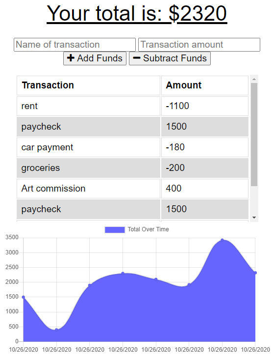

# Budget Tracker

[Live DEMO](https://secret-journey-22630.herokuapp.com/)

## Description

An application built to work both offline, and online for tracking budgeting!
Build the manifest and service-worker and deployed to heroku with connection to mongoDB to track all of your budgeting needs.

## Table Of Contents

- [Installation](#Installation)
- [Usage](#Usage)
- [Contributers](#Contributors)
- [Tests](#Tests)
- [License](#License)
- [Questions](#Questions)

## Installation

Install directly through github and run npm install. You can then deploy through heroku if you wanted a live site, or keep it on localhost.

## Usage

Just go straight to the heroku link provided and you can track a budget and see your progress.

## Contributors

Sami Sully and Georgia Tech Bootcamp Students and Staff for teaching me to write this!

(https://www.github.com/SamiSully)

HTML, CSS, BOOTSTRAP, JAVASCRIPT, NODE.JS, JQUERY, EXPRESS, & MONGODB.

## License

MIT License

(https://choosealicense.com/licenses/mit/)

Copyright © Sami Sully 2020

## Questions

If you have any questions, you can reach out to me directly at samilsuly@gmail.com
